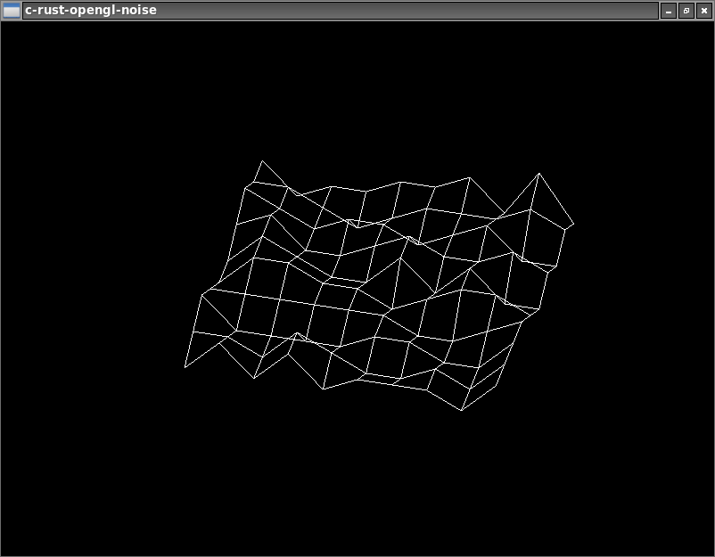

# c-rust-opengl-noise

Simple random noise generation, drawing result with OpenGL in C,
using a Rust library for the noise creation.



## Requirements

The following tools are required:
 * cargo (Rust nightly),
 * gcc
 * freeglut

The program uses Freeglut for window management, OpenGL context rendering
and events handling as the final rendering procedure is really simple
and the program is small.

### Install `freeglut` on Archlinux

```sh
pacman -S freeglut
```

### Install `glut` on Ubuntu

```sh
apt-get install libglut3-dev
```

## Install sub-module (Rust A-Star library)

```bash
git submodule init
git submodule update
```

## Compile

The following command compiles both
of the C program and the Rust library.

```sh
make
```

## Remove previous compilation data

```sh
make clean
```
